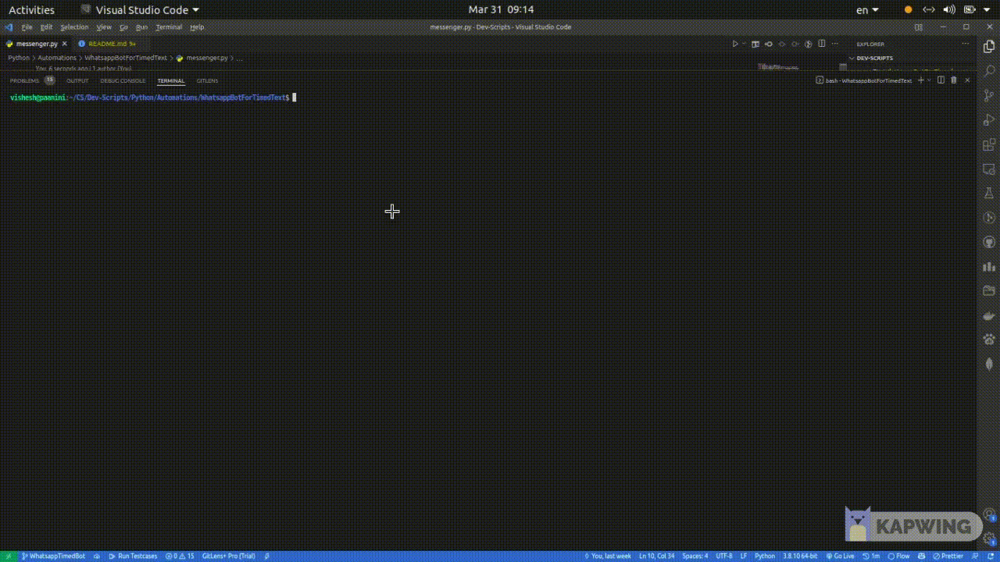

# Whatsapp bot for timed texts
Sends a given text message after a specified waiting time.

## Tech Stack
Python, Selenium

## Demonstration


## Running on local
1. Fork the repo clicking on the fork button in the top right corner

2. Clone the repo to your local machine using the following command 

```
git clone https://github.com/<your-github-username>/whatsapp-timed-messenger.git
```

3. Package to be installed: selenium==4.1.2, webdriver-manager==3.5.4. Run the following:

```
pip install selenium==4.1.2
pip install webdriver-manager==3.5.4
```
4. Just run the messenger.py with command line arguments in the following format `message wait_time`. Message must be enclosed in string quotes and the time should be stricly in number of seconds.

```
python messenger.py 'message to be sent in string quotes' wait_time
```
